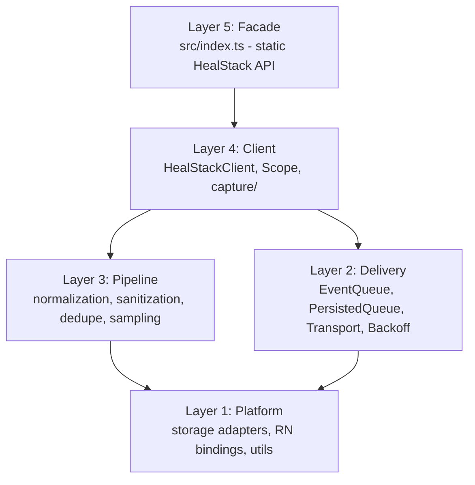
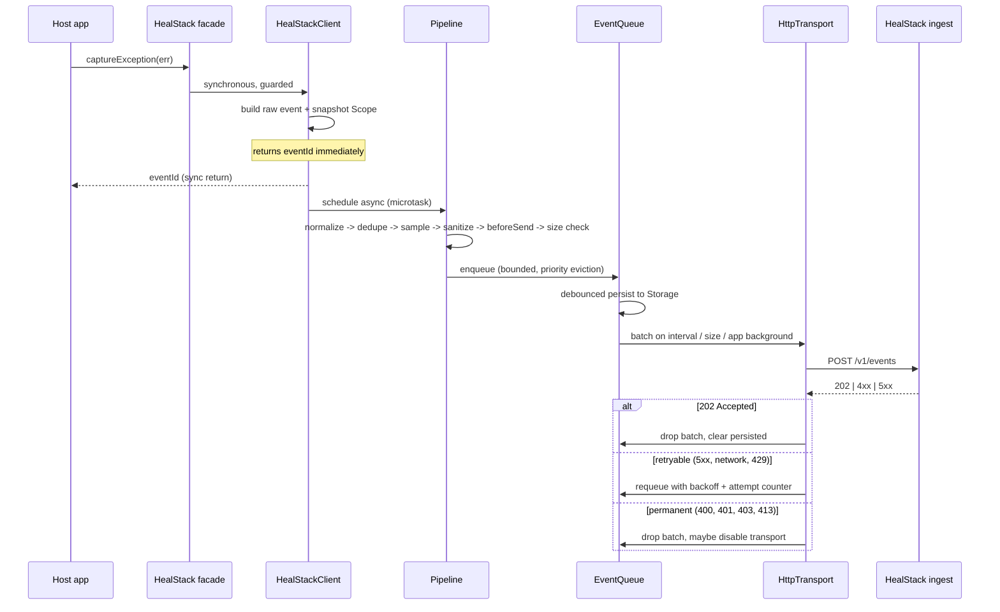
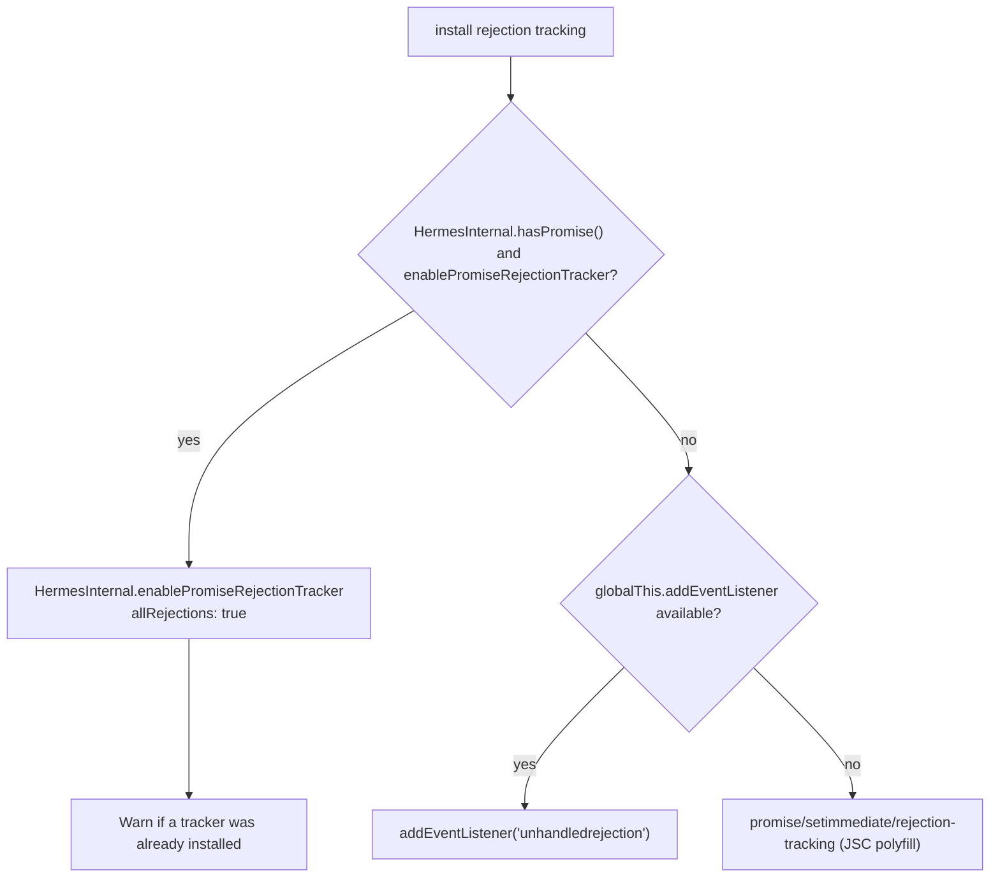
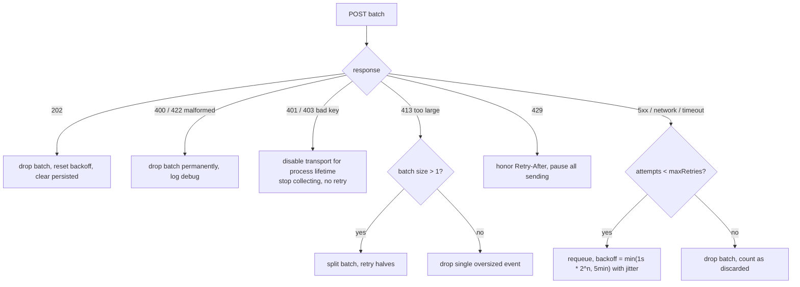

# @healstack/react-native — Architecture

**Status: implemented reference (v0.1.0)**  
This document describes the shipped SDK. If a detail conflicts with `README.md`,
`docs/performance.md`, `docs/reliability-review.md`, `docs/security.md`, or
`docs/public-api-review.md`, prefer those specialized docs and the source under `src/`.

**Non-goals remain:** native crash capture, source-map upload CLI, tracing, auto network/navigation instrumentation (see §1).

---

## Delivery behavior (authoritative for v0.1)

| Condition | Behavior |
| --- | --- |
| HTTP 2xx | Persist queue (remove drained batch from disk) |
| HTTP 401/403 | Disable transport; drained batch not requeued; `flush` stops |
| HTTP 413 / too_large | If batch size &gt; 1 → **split in half and requeue**; if size 1 → drop |
| malformed | Drop batch |
| network / 5xx / timeout / 429 | Requeue batch; stop current flush (retry on next interval / flush). `Retry-After` applies **within** the current `HttpTransport.send` attempt loop only — there is no global send pause across flushes |
| Per-send retries | Up to `maxRetries` after the first attempt (transient only). Exhaustion does **not** permanently drop — events are requeued for a later flush until age/size eviction |

Auto-flush uses a single self-rescheduling timer (not stacked intervals). Concurrent `flush()` calls share one in-flight drain.

> **Note:** Sections below retain useful design rationale but may still mention files or behaviors that were redesigned (e.g. a global `isProcessing` mutex was removed in favor of concurrent captures + hook-depth guards; there is no `RateLimiter.ts` module — backoff lives in `HttpTransport` / `backoff.ts`). Treat the table above as the delivery contract.

---

## 1. Context and goals

HealStack is an application reliability and self-healing platform. `@healstack/react-native` is the first public package: the in-app agent that observes a React Native application at runtime and reports normalized failure events to the HealStack ingest API.

The SDK's job is narrow and it should stay narrow:

- Observe JavaScript/runtime failures and surrounding context.
- Normalize them into a stable, versioned wire format.
- Get them to the backend reliably, cheaply, and without ever harming the host app.

Everything else (symbolication, grouping, triage, fixes) belongs to the backend.

### Non-goals for v1

| Out of scope | Why | Planned for |
| --- | --- | --- |
| Native crash capture (iOS/Android signals, OOM, ANR) | Requires native modules; large surface area | v2 (`@healstack/react-native` native add-on) |
| Source map / bundle symbolication upload | Belongs to a CLI + backend pipeline | v1.1 (`@healstack/cli`) |
| Performance tracing / spans | Different data model, different sampling | v2 |
| Session tracking, release health | Needs backend aggregation semantics first | v2 |
| Automatic network / navigation / console instrumentation | Highest-risk-of-breaking-the-host area; manual breadcrumbs first | v1.1, opt-in integrations |
| Expo-specific APIs | Must work in bare React Native CLI projects | Never required; optional adapter possible |

---

## 2. Guiding principle: the SDK is a guest

Every design decision below resolves in favour of the host application. Concretely, three invariants drive the architecture:

1. **No SDK error may ever surface in application code.** Every public method and every async continuation is wrapped in a failure sink.
2. **No unbounded resource may exist.** Memory, event size, queue length, retry count, breadcrumb count, recursion depth, and persisted bytes are all explicitly capped.
3. **No work happens on the critical path.** Public methods do the minimum synchronous work required to capture data, then hand off to an async pipeline.

Where a design choice trades fidelity for safety, we take safety.

---

## 3. Proposed architecture

### 3.1 Layering

The SDK is organized as five layers with a strict one-way dependency rule: a layer may only import from layers below it. This is what makes the package unit-testable in plain Node without a React Native runtime.



Only **Layer 1** is allowed to `import` from `react-native`. Layers 2–5 are pure TypeScript. An ESLint `no-restricted-imports` rule enforces this, which means ~90% of the codebase runs under a plain Jest/Node environment with no RN mocking.

### 3.2 Event lifecycle



The critical detail: `captureException` returns synchronously with an event ID, but all normalization, sanitization, and `beforeSend` work is deferred to a microtask. The caller never waits for JSON serialization or user-supplied hook code.

---

## 4. Package structure

Close to the proposed layout, with deviations documented in §4.2.

```
healstack-sdk/
  src/
    index.ts                      # public facade + re-exported types

    client/
      HealStackClient.ts          # orchestrator, owns Scope + queue + transport
      clientRegistry.ts           # module-level current-client holder (init idempotency)

    config/
      types.ts                    # HealStackOptions
      defaults.ts                 # DEFAULT_OPTIONS + hard caps
      validation.ts               # resolveOptions(): validate, clamp, never throw

    capture/
      exception.ts                # captureException
      message.ts                  # captureMessage
      globalHandlers.ts           # ErrorUtils install/uninstall
      promiseRejection.ts         # Hermes / polyfill rejection tracking

    context/
      Scope.ts                    # user + tags + extra + contexts + breadcrumbs
      breadcrumbs.ts              # BreadcrumbBuffer (bounded ring buffer)
      runtime.ts                  # assembles app/device/os/runtime contexts

    normalization/
      normalizeException.ts       # unknown -> ExceptionValue
      normalizeStackTrace.ts      # raw stack string -> StackFrame[]
      normalizeEvent.ts           # raw -> HealStackEvent (schema v1)
      normalizeValue.ts           # depth/breadth/cycle-safe value coercion

    sanitization/
      sanitizeEvent.ts            # orchestrates redaction
      redactKeys.ts               # key-pattern deny list
      redactUrl.ts                # strip credentials, query secrets

    queue/
      EventQueue.ts               # in-memory bounded queue + eviction policy
      PersistedQueue.ts           # write-behind durability policy
      Batcher.ts                  # batch assembly + flush triggers
      dedupe.ts                   # short-window duplicate suppression

    transport/
      Transport.ts                # interface + result types
      HttpTransport.ts            # fetch-based implementation
      Backoff.ts                  # exponential backoff + jitter
      RateLimiter.ts              # Retry-After / server-directed backoff

    storage/
      Storage.ts                  # async KV interface
      MemoryStorage.ts            # default
      detectAsyncStorage.ts       # ISOLATED optional require (see 7.3)
      asyncStorageAdapter.ts      # exported via ./async-storage subpath

    platform/
      reactNative.ts              # ONLY file importing 'react-native'
      appState.ts                 # background/foreground hooks
      globals.ts                  # ErrorUtils, HermesInternal, __DEV__ access

    utils/
      logger.ts                   # production-safe logger
      safe.ts                     # safe() / safeAsync() failure sinks
      uuid.ts
      time.ts
      size.ts                     # UTF-8 byte length
      environment.ts
      isError.ts

    types/
      events.ts                   # wire event schema v1
      api.ts                      # request/response envelopes
      public.ts                   # exported public types

  docs/
    architecture.md
    public-api-review.md          # supported surface, internal vs experimental
    npm-release.md                # pack/publish checklist (no auto-publish)
    security.md                   # security audit, guarantees, residual risks
    performance.md                # costs, trade-offs, production defaults
    reliability-review.md         # hostile failure scenarios + fixes
    wire-protocol.md              # the contract the backend must implement
  example/                        # Expo RN app consuming the package entry
  README.md
```

### 4.2 Documented deviations from the proposed structure

| Deviation | Rationale |
| --- | --- |
| `context/user.ts` + `context/tags.ts` replaced by `context/Scope.ts` | Three module-level mutable singletons make test isolation fragile and make multi-client (or test-harness) usage impossible. A single `Scope` object owned by the client is cheaper to snapshot atomically per event and trivially resettable between tests. |
| Added `platform/` layer | Confining every `react-native` import to one directory is what allows the rest of the SDK to be tested in Node with no RN preset, and is the cleanest path to a future `@healstack/core` shared with a web SDK. |
| `queue/QueueStorage.ts` split into `storage/Storage.ts` + `queue/PersistedQueue.ts` | The original structure duplicated the storage concern. Separating the *mechanism* (a KV interface) from the *policy* (when/what/how much to persist) lets us test the policy with an in-memory KV and swap the mechanism freely. |
| Added `utils/safe.ts`, `utils/logger.ts` | Directly implements design principles 1, 2, 12, 13, and 27. Not optional infrastructure. |
| Added `queue/dedupe.ts`, `transport/Backoff.ts`, `transport/RateLimiter.ts` | Principles 9, 10, 16 need real implementations, not inline logic. |
| Added `normalization/normalizeValue.ts` | Cycle/depth-safe coercion is needed by breadcrumbs, extras, contexts, and sanitization alike. Sharing it avoids three subtly different recursive walkers. |
| `client/clientRegistry.ts` | Makes `init()` idempotency and `close()` semantics explicit and testable rather than hidden module state in `index.ts`. |

---

## 5. Public API design

### 5.1 Shape

Both a namespace object and named exports, so tree-shaking works for ESM consumers while the documented `HealStack.x()` style still reads well.

```ts
import * as HealStack from '@healstack/react-native';
// or
import { init, captureException } from '@healstack/react-native';
```

```ts
// Lifecycle
function init(options: HealStackOptions): void;
function isInitialized(): boolean;
function flush(timeoutMs?: number): Promise<boolean>;
function close(timeoutMs?: number): Promise<boolean>;

// Capture
function captureException(error: unknown, hint?: CaptureHint): string;
function captureMessage(message: string, level?: SeverityLevel, hint?: CaptureHint): string;
function addBreadcrumb(breadcrumb: BreadcrumbInput): void;

// Scope
function setUser(user: UserContext | null): void;
function setTag(key: string, value: string | number | boolean): void;
function setTags(tags: Record<string, string | number | boolean>): void;
function setExtra(key: string, value: unknown): void;
function setContext(key: string, context: Record<string, unknown> | null): void;

// Introspection / escape hatch
function lastEventId(): string | undefined;
function getClient(): HealStackClient | undefined;
```

### 5.2 Semantics chosen for safety

- **`captureException` returns the event ID synchronously**, even if the event is later dropped by sampling, `beforeSend`, or size limits. The caller gets a correlation ID without awaiting the pipeline.
- **Every function is safe before `init()` and after `close()`.** They become no-ops; capture functions return a generated-but-unused ID. No throwing, no warning spam beyond a single debug-level message.
- **`flush(timeout)` resolves `true`** if the queue drained within the timeout, `false` otherwise. Never rejects. Concurrent calls share one in-flight drain.
- **`close(timeout)`** = `flush(timeout)` + uninstall global handlers + persist remainder + mark client disabled. Idempotent; repeat calls resolve immediately with `true`.
- **`init()` is idempotent.** A second call with identical options is a no-op. A second call with *different* options logs a debug warning and is ignored — silently swapping config under a running queue is a worse failure mode than ignoring it.

### 5.3 Forward compatibility

The additive-only rules we commit to:

- `HealStackOptions` fields are all optional except `apiKey` and `endpoint`. New options get defaults.
- Unknown option keys are ignored, not rejected — an app on SDK 1.0 passing a 1.4 option must not break.
- The event wire format carries `schema_version`, so the backend can evolve independently.
- `SeverityLevel`, `BreadcrumbType` are `string`-widened unions (`'navigation' | 'http' | ... | (string & {})`) so new values don't break `exactOptionalPropertyTypes` consumers.
- `Transport` and `Storage` are interfaces, so custom implementations survive internal refactors.
- Nothing internal is exported from the root. Advanced surface goes behind subpath exports (`./async-storage`, later `./testing`).

### 5.4 Configuration

```ts
interface HealStackOptions {
  // Required
  apiKey: string;                 // hs_live_* / hs_test_*
  endpoint: string;               // https:// base URL

  // Identity
  environment?: string;           // default: __DEV__ ? 'development' : 'production'
  release?: string;               // e.g. "com.acme.app@1.4.2"
  dist?: string;                  // build number

  // Switches
  enabled?: boolean;              // default true
  debug?: boolean;                // default false
  sampleRate?: number;            // 0..1, default 1

  // Auto-capture
  autoCaptureUnhandledErrors?: boolean;      // default true
  autoCaptureUnhandledRejections?: boolean;  // default true
  flushOnAppBackground?: boolean;            // default true
  enableDeduplication?: boolean;             // default true
  attachStacktraceToMessages?: boolean;      // default true

  // Bounds (all clamped to hard caps in defaults.ts)
  maxBreadcrumbs?: number;        // default 50,  cap 200
  maxQueueEvents?: number;        // default 100, cap 500
  maxQueueBytes?: number;         // default 1 MiB
  maxEventBytes?: number;         // default 200 KiB
  maxBatchEvents?: number;        // default 20
  maxEventAgeMs?: number;         // default 24h
  flushIntervalMs?: number;       // default 5000; 0 disables; else soft-min 1000
  requestTimeoutMs?: number;      // default 15000
  maxRetries?: number;            // default 5

  // Privacy
  sendDefaultPii?: boolean;       // default false
  scrubFields?: string[];         // additional key patterns to redact

  // Hooks
  beforeSend?: (event, hint) => HealStackEvent | null | Promise<HealStackEvent | null>;
  beforeBreadcrumb?: (crumb, hint) => Breadcrumb | null;
  onInternalError?: (error: Error) => void;

  // Injection (testing / advanced)
  storage?: 'auto' | 'memory' | HealStackStorage;
  transport?: (options: ResolvedOptions) => Transport;
  transportHeaders?: Record<string, string>;
}
```

`validation.ts` exposes `resolveOptions(raw): ResolvedOptions | null`. It **never throws**. It clamps out-of-range numbers to caps, coerces wrong types where unambiguous, logs one debug message per correction, and returns `null` only for unrecoverable problems (missing/malformed `apiKey`, missing/non-`http(s)` `endpoint`) — in which case the SDK stays permanently disabled and every API becomes a no-op.

---

## 6. Dependency choices

**Runtime `dependencies`: none.** This is a hard requirement for an SDK — every transitive dependency is a supply-chain and bundle-size liability in someone else's app, and version conflicts in RN are painful.

| Package | Role | Notes |
| --- | --- | --- |
| `react-native` | `peerDependency` `>=0.71.0` | Only `Platform`, `AppState`, `Dimensions` are used, all long-stable public APIs. |
| `react` | `peerDependency` `>=17` | Not used at runtime in v1; declared for future error-boundary component. |
| `@react-native-async-storage/async-storage` | **optional** `peerDependency` `>=1.17` | Via `peerDependenciesMeta.optional: true`. Never imported from the main entry point. |

Things deliberately **not** used, and what replaces them:

- `uuid` → ~15 lines using `crypto.randomUUID` / `crypto.getRandomValues` with a `Math.random` fallback. Event IDs need uniqueness, not cryptographic strength.
- `error-stack-parser` / `stacktrace-js` → our own parser. We only need Hermes, JSC, and V8 formats, and a third-party parser that throws inside our error handler is a very bad day.
- `axios` → `fetch`, which RN ships.
- `lodash` → nothing; the two or three helpers we need are trivial and must be cycle-safe anyway.

Dev dependencies: TypeScript 5.9, ESLint 9 (flat config) + `@typescript-eslint`, Prettier 3, Jest 30, `react-native-builder-bob`, `publint`, `@arethetypeswrong/cli`, `@changesets/cli`.

---

## 7. React Native compatibility

### 7.1 New Architecture (Fabric / TurboModules / bridgeless)

The SDK is compatible **by construction**: it ships no native code and never touches the bridge. One concrete rule follows from bridgeless mode though —

> **Never use `NativeModules`.** Direct `NativeModules.X` access is deprecated and unreliable under bridgeless. All device/app context comes from `Platform.constants`, `Dimensions`, and `AppState`, which are stable public APIs in both architectures.

### 7.2 Runtime context collected (no native modules, no PII)

| Context | Source | Notes |
| --- | --- | --- |
| `os.name`, `os.version` | `Platform.OS`, `Platform.Version` | |
| `device.model`, `device.manufacturer`, `device.brand` | `Platform.constants` | Android only; iOS has no model without a native module. Documented gap. |
| `device.screen` | `Dimensions.get('screen')` | Width/height/scale/fontScale. |
| `app.state` | `AppState.currentState` | active/background/inactive at capture time. |
| `runtime.name`, `runtime.version` | `HermesInternal.getRuntimeProperties()` | Falls back to `"jsc"` / `"unknown"`. |
| `runtime.react_native_version` | `Platform.constants.reactNativeVersion` | |
| `app.build_type` | `__DEV__` | |

Explicitly **not** collected: IP address (unless `sendDefaultPii`), device IDs/IDFA/advertising IDs, locale-derived identifiers, installed apps, network carrier, battery, precise location. Nothing here is an identifier for a person or a device.

### 7.3 Unhandled error capture

**Uncaught JS errors** — chain onto `global.ErrorUtils`:

```ts
const previous = ErrorUtils.getGlobalHandler?.();
ErrorUtils.setGlobalHandler((error, isFatal) => {
  safe(() => captureFatal(error, isFatal));   // never throws
  previous?.(error, isFatal);                  // always call through
});
```

Always delegating to the previous handler is non-negotiable: RN's `ExceptionsManager` is that handler, and swallowing it removes the red box in dev and changes crash behaviour in production.

**Unhandled promise rejections** — engine-specific, and this one carries a real caveat:



> **Known conflict:** Hermes supports exactly **one** active rejection tracker. If the host app also runs `@sentry/react-native` (or anything else calling `enablePromiseRejectionTracker`), whichever installs last wins and the other silently stops receiving rejections. We will detect a pre-existing tracker where possible, log a warning, and document `autoCaptureUnhandledRejections: false` as the escape hatch. This is an ecosystem limitation we cannot engineer around.

### 7.4 Metro and module resolution

Metro enables `package.json` `"exports"` by default only from **RN 0.79 / Metro 0.82**. Since we support `>=0.71`, the package must ship *both* an `exports` map and the legacy `main` / `module` / `react-native` fields, kept consistent. See §11.

---

## 8. Storage strategy

### 8.1 Interface

```ts
interface HealStackStorage {
  getItem(key: string): Promise<string | null>;
  setItem(key: string, value: string): Promise<void>;
  removeItem(key: string): Promise<void>;
}
```

Deliberately the AsyncStorage subset — anything satisfying it (MMKV, SQLite wrapper, expo-secure-store) can be dropped in with no adapter.

### 8.2 Resolution order

1. `options.storage` is an object → use it verbatim.
2. `options.storage === 'memory'` → `MemoryStorage`.
3. `options.storage === 'auto'` (default) → best-effort AsyncStorage detection, else `MemoryStorage`.

### 8.3 The AsyncStorage problem, and how we handle it

We want persistence without a mandatory dependency. The standard trick is `require()` inside `try/catch`, which Metro treats as optional — but Metro's implementation has a [documented bug](https://github.com/facebook/metro/issues/836): when an optional dependency fails to resolve, the dependency map shifts and **every subsequent `require` in the same file resolves to the wrong module**. It is also only enabled when `transformer.allowOptionalDependencies` is on (default in the RN CLI config, but not in bare Metro).

So we use a two-track approach:

**Track A — guaranteed, recommended in the README.** A subpath export with a plain static import. No bundler magic; the module is only pulled into the graph if the user imports it, and they will only import it if they installed the package.

```ts
import AsyncStorage from '@react-native-async-storage/async-storage';
import { init, createAsyncStorageAdapter } from '@healstack/react-native';

init({ apiKey, endpoint, storage: createAsyncStorageAdapter(AsyncStorage) });
```

**Track B — best-effort auto-detect.** `storage/detectAsyncStorage.ts` contains the optional `require` and **nothing else** — no other imports, no other requires, the optional one is the last statement. That structurally sidesteps Metro bug #836, since there are no subsequent requires to corrupt. If it fails for any reason, we fall back to memory and log at debug level.

```ts
// storage/detectAsyncStorage.ts — this file must contain no other imports.
export function detectAsyncStorage(): HealStackStorage | null {
  try {
    // eslint-disable-next-line @typescript-eslint/no-require-imports
    const mod = require('@react-native-async-storage/async-storage');
    const impl = mod?.default ?? mod;
    return isStorageLike(impl) ? impl : null;
  } catch {
    return null;
  }
}
```

### 8.4 What gets persisted

Two keys only, under the `healstack:` namespace:

- `healstack:queue:v1` — JSON array of pending events.
- `healstack:meta:v1` — schema version, last-flush timestamp, transport disable state.

Write policy, because AsyncStorage is a slow cross-thread KV store and writing per-event would be a performance bug:

- **Debounced**, 2s trailing, coalescing multiple enqueues into one write.
- **Forced** on app background, on `close()`, and immediately for `fatal`-level events (the app may be about to die).
- **Capped** at `maxQueueBytes` (1 MiB default). Persisting is skipped entirely rather than truncating mid-JSON.
- **Single-writer**: overlapping writes are serialized through a promise chain so a slow write can never interleave and corrupt the blob.
- **Read once**, at init. A parse failure or schema mismatch drops the blob and continues — a corrupt queue must never prevent startup.
- Events older than `maxEventAgeMs` are discarded on rehydration.

### 8.5 Trade-off

With the default `'auto'` storage and AsyncStorage absent, the SDK still works fully offline *within a session* (in-memory queue + retry), but loses pending events on cold start. Persistence across restarts is one import away. We accept this rather than forcing a dependency on every consumer, and the README will state it plainly.

---

## 9. Queue strategy

### 9.1 Structure

`EventQueue` is a bounded FIFO tracking both count and serialized byte total.

**Eviction** when full is priority-aware rather than naive FIFO: drop the **oldest lowest-severity** event first (`debug` < `info` < `warning` < `error` < `fatal`). Losing a stale breadcrumb-ish info event to keep a fatal crash is the right call. Every eviction increments a counter reported as `discarded_events` on the next successful request, so the backend can see data loss instead of guessing.

### 9.2 Flush triggers

A batch is sent when any of these fire:

- `flushIntervalMs` timer elapses (5s) and the queue is non-empty.
- Queue reaches `maxBatchEvents` (20).
- A `fatal` event is enqueued (immediate).
- App transitions to `background` / `inactive`.
- `flush()` or `close()` is called.

Timers use a **self-rescheduling `setTimeout`, not `setInterval`** — this guarantees no overlapping flushes and no timer pile-up when the device is offline.

### 9.3 Retry and backoff



The loop-prevention rules that matter:

- Attempt count is **per batch**, capped at `maxRetries` (5). After that the batch is dropped, not retried forever.
- Backoff is exponential with **full jitter** (`random(0, min(base * 2^n, 300_000))`) to prevent thundering-herd retries from an entire user base when the backend recovers.
- A `401`/`403` is a **kill switch**, not a retry. A wrong API key must not generate perpetual traffic from every install.
- A `429` pauses *all* sending until `Retry-After` elapses, not just the failing batch.
- Only one request is in flight at a time. Never parallel batches.

### 9.4 Deduplication

An LRU of event fingerprints (hash of exception type + value + top 3 stack frames) with a 5-second window and 50-entry cap. A duplicate within the window is suppressed and increments a counter on the original. This kills the common "error inside a render loop fires 400 times" pathology. Disabled via `enableDeduplication: false`.

---

## 10. Error-handling strategy

### 10.1 The failure sink

Every entry point into the SDK — public methods, timer callbacks, promise continuations, global handlers, user hooks — is wrapped:

```ts
export function safe<T>(fn: () => T, fallback: T, tag: string): T {
  try {
    return fn();
  } catch (error) {
    handleInternalError(error, tag);   // logger + options.onInternalError
    return fallback;
  }
}
```

`handleInternalError` itself is wrapped in a bare `try/catch` — even a broken `onInternalError` callback from the host cannot escape.

### 10.2 Re-entrancy guard

An error thrown *while processing an error* is the classic SDK death spiral. A module-level `isProcessing` flag causes any capture triggered during pipeline execution to be dropped immediately. Combined with the global handler chaining onto the previous handler rather than replacing it, this makes an infinite crash loop structurally impossible.

### 10.3 User hooks are hostile input

`beforeSend`, `beforeBreadcrumb`, and `onInternalError` are application code. Each is called inside `safeAsync` with a timeout (2s for `beforeSend`). A hook that throws, returns garbage, or hangs results in the event being dropped, never in a broken SDK.

### 10.4 Production-safe logging

`utils/logger.ts`:

- **Silent by default.** Zero console output unless `debug: true`.
- Even with `debug: true`, output is suppressed when `!__DEV__` unless the user explicitly opts in — a production build should not spam the host's log pipeline.
- All output is prefixed `[HealStack]`.
- **Secret scrubbing at the logger boundary**: any string matching `hs_(live|test)_\w+`, or any value under a key matching the secret deny-list, is replaced with `[redacted]` *before* it reaches `console`. This means an API key cannot be logged even by accident from a future code path. Defence in depth beyond "remember not to log it".
- The full URL including query string is never logged; only the origin.

### 10.5 PII sanitization

`sanitizeEvent` runs **after** `beforeSend` (so user transformations can't reintroduce secrets) and walks the event with bounded depth (5) and breadth (100 keys), cycle-safe.

- **Key deny-list** (case/underscore/hyphen-insensitive): `password`, `passwd`, `secret`, `token`, `api_key`, `apikey`, `authorization`, `auth`, `credential`, `session`, `cookie`, `csrf`, `private_key`, `access_key`, `refresh_token`, `credit_card`, `card_number`, `cvv`, `ssn`, `pin`. Matched values become `[redacted]`. Extendable via `scrubFields`.
- **URL scrubbing**: strip `user:pass@`, and redact query parameter values whose keys hit the deny-list.
- **`sendDefaultPii: false` (default)** drops `user.email`, `user.username`, `user.ip_address`; only `user.id` survives.
- Strings longer than 8 KiB are truncated with a `…[truncated]` marker.
- The API key never appears in a payload body — it travels in a header only.

---

## 11. Build strategy

**Tool: `react-native-builder-bob`** (targets: `commonjs`, `module`, `typescript`).

Chosen over `tsup`/`rollup` because it is the React Native community standard, preserves module structure rather than bundling (better for Metro's resolver and for tree-shaking), emits a Babel-compiled CJS + ESM pair plus `tsc` declarations, and validates `package.json` field consistency on every build. `tsup` would be marginally faster but we would be hand-maintaining RN-specific field correctness that bob already encodes.

```
lib/
  commonjs/    # CJS, RN >= 0.71 without exports support, Node/Jest
  module/      # ESM, tree-shakeable
  typescript/  # .d.ts + .d.ts.map
```

```jsonc
{
  "main": "./lib/commonjs/index.js",
  "module": "./lib/module/index.js",
  "types": "./lib/typescript/src/index.d.ts",
  "react-native": "./lib/module/index.js",
  "exports": {
    ".": {
      "types": "./lib/typescript/src/index.d.ts",
      "react-native": "./lib/module/index.js",
      "import": "./lib/module/index.js",
      "require": "./lib/commonjs/index.js"
    },
    "./async-storage": { /* same shape */ },
    "./package.json": "./package.json"
  },
  "sideEffects": false,
  "files": ["lib", "src", "README.md", "LICENSE"]
}
```

Two deliberate choices here:

- **`"react-native"` points at built ESM, not `src/index.ts`.** The bob scaffold ships raw source as the RN entry, which works because Metro compiles TypeScript — but it breaks for consumers with customized Babel configs, `transformIgnorePatterns` tuned to skip `node_modules`, or non-Metro bundlers. Shipping compiled output is the safer default for a package that must work in unknown project setups. `src` is still published for source-map and debugging purposes.
- **`sideEffects: false`** is accurate: the SDK does nothing until `init()` is called. No module-level handler installation.

TypeScript is `strict` plus `noUncheckedIndexedAccess`, `exactOptionalPropertyTypes`, `noImplicitOverride`, `noFallthroughCasesInSwitch`, `isolatedModules`, `verbatimModuleSyntax`. Target ES2017 (Hermes-safe), no `lib.dom` — all global access goes through explicitly declared feature-detected shims in `platform/globals.ts`.

### Package validation gate

`npm run validate` runs, and CI blocks the release on:

1. `tsc --noEmit` (source typecheck).
2. `publint` — `exports`/`main`/`types` correctness, missing files.
3. `attw --pack` — no `Masquerading as CJS/ESM`, no `FalseExportDefault`.
4. `npm pack --dry-run` with a **tarball size budget** (fail over 150 KB).
5. **Consumption smoke test**: pack the tarball, install it into throwaway CJS and ESM fixture projects outside the repo, `require()`/`import` it, call `init()` + `captureException()` against a mock transport, and typecheck the fixtures under both `moduleResolution: "node"` and `"bundler"`. This catches the export-map mistakes that unit tests never will.
6. A **zero-dependency assertion** — fail if `dependencies` is non-empty.

---

## 12. Testing strategy

Because only `src/platform/` touches React Native, the default Jest project runs in plain Node with no RN preset — fast, and no mocking gymnastics.

**Two Jest projects:**
- `unit` — Node environment, everything outside `src/platform/`.
- `native` — `preset: 'react-native'`, covers `platform/`, global handler installation, and AppState wiring.

**Test doubles** (in `src/testing/`, published later behind a subpath): `MemoryTransport` (records batches), `FailingTransport` (scripted status codes), `FakeStorage` (with injectable latency and failures), injectable clock and ID generator so event snapshots are deterministic.

| Area | What we assert |
| --- | --- |
| Normalization | `Error`, subclasses, `cause` chains, strings, numbers, `null`, `undefined`, plain objects, circular objects, frozen objects, objects with throwing getters, DOMException-likes. Hermes/JSC/V8 stack formats each parse to correct frames. |
| Sanitization | Deny-list keys redacted at every depth; nested/circular safe; URL credentials stripped; `sendDefaultPii` gating; API key absent from any serialized payload (asserted by scanning the full JSON string). |
| Queue | Count and byte bounds; priority eviction keeps fatals; `discarded_events` accounting; rehydration drops expired and corrupt data. |
| Retry | Fake timers drive backoff schedule; jitter bounded; `maxRetries` terminates; 401 kill switch; 429 `Retry-After`; 413 batch splitting; no parallel in-flight requests. |
| Lifecycle | `init` idempotency; all APIs no-op before init and after close; `flush`/`close` safe to call repeatedly and concurrently; `close` during an in-flight request. |
| Global handlers | Previous `ErrorUtils` handler always invoked; Hermes vs JSC vs web rejection paths; handlers uninstalled on `close`. |
| **Robustness suite** | A dedicated `never-throws.test.ts`: every public method invoked with a fuzz corpus of hostile inputs (`null`, `undefined`, `Symbol`, circular, proxies with throwing traps, 10 MB strings, 10k-deep nesting) in every lifecycle state. **Any throw is a test failure.** This is the executable form of design principles 1 and 2. |
| Hook hostility | `beforeSend` that throws / hangs / returns `undefined` / returns a mutated-to-garbage event — SDK survives, event dropped. |
| Wire contract | Golden-file snapshot of the serialized payload, reviewed on change, so backend-breaking edits are visible in diff. |

Coverage gates: 90% lines/branches globally, **100% on `sanitization/` and `utils/safe.ts`**. Plus a bare RN CLI `example/` app for manual verification on device (release build, airplane mode, cold start with pending queue).

---

## 13. npm publishing strategy

- **Package**: `@healstack/react-native`, public scoped, MIT (confirm with legal).
- **Versioning**: semver, starting `0.1.0`. No `1.0.0` until the wire protocol is frozen and the backend is live. Pre-1.0 we still treat breaking changes as minor bumps with a changelog entry.
- **Release tooling**: Changesets. Every PR touching `src/` requires a changeset; CI enforces it. Changesets generates `CHANGELOG.md` and opens the release PR.
- **CI (GitHub Actions)**: PR pipeline = lint, format check, typecheck, both Jest projects, build, `validate`. Release pipeline runs on merge of the release PR and publishes with **`npm publish --provenance --access public`** from a trusted workflow, so consumers get a verifiable supply-chain attestation.
- **Dist tags**: `latest` for stable, `next` for prereleases, `canary` for per-commit builds off `main` for internal dogfooding.
- **Pre-publish safety**: `prepublishOnly` runs the full validation gate; `.npmrc` sets `provenance = true`; 2FA required on the npm org; a `publishConfig.access: "public"` so a scoped package is never accidentally published private.
- **Deprecation policy**: nothing exported from the root is removed without one minor release of `@deprecated` JSDoc plus a runtime debug warning.

---

## 14. README structure

1. Title, badges (npm version, bundle size, CI, license)
2. One-paragraph "what this does" + what it explicitly does *not* do yet
3. Requirements (RN >= 0.71, New Arch supported, no Expo required)
4. Install (npm/yarn/pnpm) + the optional AsyncStorage line
5. Quick start — the 6-line snippet
6. Core concepts — events, breadcrumbs, scope, the delivery pipeline (one diagram)
7. API reference — every public function, signature, semantics, return value
8. Configuration reference — full option list with defaults and caps
9. Offline behaviour and persistence — including the honest memory-only default
10. Privacy and PII — what is and is not collected, redaction defaults, `beforeSend` recipes
11. Reliability guarantees — the "never crashes your app" contract, bounds table
12. Performance — expected overhead, when work happens, what is on the critical path
13. Troubleshooting — no events arriving, Sentry rejection-tracker conflict, Metro `exports` on RN < 0.79, minified stack traces
14. Wire protocol → link to `docs/wire-protocol.md`
15. Compatibility matrix
16. Roadmap (native crashes, source maps, tracing)
17. Contributing, Code of Conduct, Security policy, License

---

## 15. Wire protocol (summary)

Full spec goes in `docs/wire-protocol.md`; it is the contract the backend must implement.

```
POST {endpoint}/v1/events
Content-Type: application/json
X-HealStack-Key: hs_live_...
X-HealStack-Sdk: @healstack/react-native/0.1.0
X-HealStack-Sent-At: 2026-09-14T12:00:00.000Z
```

```jsonc
{
  "schema_version": 1,
  "sdk": { "name": "@healstack/react-native", "version": "0.1.0" },
  "sent_at": "2026-09-14T12:00:00.000Z",
  "discarded_events": 0,
  "events": [
    {
      "event_id": "…uuid…",
      "type": "exception",
      "timestamp": "2026-09-14T11:59:58.120Z",
      "level": "error",
      "environment": "production",
      "release": "com.acme.app@1.4.2",
      "dist": "412",
      "exception": {
        "type": "TypeError",
        "value": "undefined is not a function",
        "mechanism": { "type": "onerror", "handled": false },
        "stacktrace": {
          "frames": [
            { "filename": "index.android.bundle", "function": "Profile", "lineno": 1, "colno": 82341, "in_app": true }
          ]
        }
      },
      "user": { "id": "123" },
      "tags": { "feature": "payments" },
      "extra": {},
      "contexts": { "app": {}, "device": {}, "os": {}, "runtime": {} },
      "breadcrumbs": [
        { "timestamp": "…", "type": "navigation", "message": "Opened Profile" }
      ]
    }
  ]
}
```

Responses: `202` accepted; `400` malformed (drop); `401`/`403` bad key (kill switch); `413` too large (split); `429` + `Retry-After` (pause); `5xx` (retry with backoff).

Note that **stack frames ship raw and unsymbolicated**. Release builds produce minified frames; symbolication is a backend concern requiring source maps uploaded at build time. Without that pipeline the product is not actually usable in production, which makes `@healstack/cli` source-map upload the highest-priority follow-up (§16).

---

## 16. Risks and trade-offs

| # | Risk | Impact | Mitigation / decision |
| --- | --- | --- | --- |
| 1 | **Fatal errors may be lost.** Persisting to AsyncStorage is async; if the JS context dies immediately, the write may not land. | High — the most valuable events are the ones most likely lost | Flush immediately on `fatal`; persist synchronously-as-possible; RN's `ExceptionsManager` typically leaves a tick of runway. Fully solved only by a native module (v2). Document honestly. |
| 2 | **No native crash capture.** Native crashes, OOM kills, ANRs, and startup crashes before `init()` are invisible. | High — a meaningful share of real-world crashes | Explicit v1 non-goal, stated in the README so nobody is misled. v2 native add-on. |
| 3 | **Unsymbolicated stack traces.** Minified frames are near-useless without source maps. | High — blocks the core value proposition | Ship `release`/`dist` so the backend can match; prioritize `@healstack/cli` source-map upload as the immediate follow-up. |
| 4 | **Hermes single-slot rejection tracker** conflicts with Sentry and similar SDKs. | Medium | Detect and warn; document `autoCaptureUnhandledRejections: false`. Cannot be fixed in userland. |
| 5 | **Metro optional-dependency bug (#836)** could corrupt module resolution. | Medium | Isolate the optional `require` in a file with no other imports; recommend the explicit subpath import as the primary path. |
| 6 | **`exports` field on RN < 0.79** is not honoured by default. | Medium | Ship consistent legacy `main`/`module`/`react-native` fields; verify in the packaged-consumption smoke test. |
| 7 | **AsyncStorage contention.** The SDK shares a single KV store with the host app; frequent writes cause jank. | Medium | Debounced coalesced writes, 1 MiB cap, serialized single-writer, forced writes only on background/fatal/close. |
| 8 | **Bounded queue means silent data loss** when offline for long periods. | Medium | Priority-aware eviction favours fatals; report `discarded_events` so loss is visible in the product rather than invisible. |
| 9 | **`beforeSend` is arbitrary user code** on the delivery path. | Medium | Timeout + `safeAsync`; sanitization runs *after* the hook so it cannot reintroduce secrets. |
| 10 | **Retry storms** when the backend recovers from an outage. | Medium | Full-jitter exponential backoff, single in-flight request, server-directed `429`/`Retry-After` honoured globally. |
| 11 | **PII leakage via `extra`/breadcrumbs.** Deny-lists are heuristics and will miss things. | Medium | Conservative defaults (`sendDefaultPii: false`), documented `beforeSend` recipes, extensible `scrubFields`, 100% test coverage on the sanitizer. We will be explicit that a deny-list is not a guarantee. |
| 12 | **Peer-dependency range `>=0.71`** spans a lot of RN surface area. | Low–Medium | Only three long-stable RN APIs are used; CI matrix tests against 0.71, 0.76, and latest. |
| 13 | **Deduplication and sampling can hide real issues.** | Low | Both documented and disableable; dedupe window is short (5s) and counts suppressed duplicates rather than discarding the signal. |
| 14 | **Clock skew** on user devices makes timestamps unreliable. | Low | Send both event `timestamp` and request `sent_at`; the backend computes skew against its own `received_at`. |
| 15 | **`react-native` peer dep makes the package RN-only**, blocking reuse for a future web SDK. | Low | The `platform/` boundary is designed so a `@healstack/core` extraction is mechanical rather than a rewrite. |

---

## 17. Open questions for the team

1. **License** — MIT assumed. Confirm.
2. **API key format** — validation currently assumes an `hs_live_` / `hs_test_` prefix. Confirm the real format, or we relax to a length/charset check.
3. **Endpoint shape** — does the customer supply a bare host (`https://api.healstack.io`) with the SDK appending `/v1/events`, or a full ingest URL? Proposal above assumes the former.
4. **Minimum RN version** — `>=0.71` proposed. Dropping to `>=0.76` would let us assume the New Architecture and simplify the compatibility matrix.
5. **Default `environment`** — derived from `__DEV__`, or required explicitly? Proposal derives it.

---

## 18. Proposed implementation order

Each phase ends green (lint, typecheck, tests) and is independently reviewable.

1. **Foundation** — repo scaffolding, TS/ESLint/Prettier/Jest config, `utils/`, `types/`.
2. **Config** — `types.ts`, `defaults.ts`, `validation.ts` + tests.
3. **Context** — `Scope`, breadcrumb ring buffer, `platform/reactNative.ts`, `runtime.ts`.
4. **Normalization + sanitization** — the highest-value test surface; build it before anything depends on it.
5. **Storage + queue** — `Storage`, `MemoryStorage`, `EventQueue`, `PersistedQueue`, `dedupe`.
6. **Transport** — `Transport`, `HttpTransport`, `Backoff`, `RateLimiter`.
7. **Client + facade** — `HealStackClient`, `src/index.ts`, lifecycle semantics.
8. **Global handlers** — `ErrorUtils` chaining, engine-specific rejection tracking.
9. **Hardening** — the `never-throws` robustness suite, re-entrancy guard, coverage gates.
10. **Packaging** — bob build, `exports` map, `publint`/`attw`, packaged-consumption smoke test.
11. **Docs + release** — README, `wire-protocol.md`, Changesets, CI, `0.1.0` to the `next` tag.
